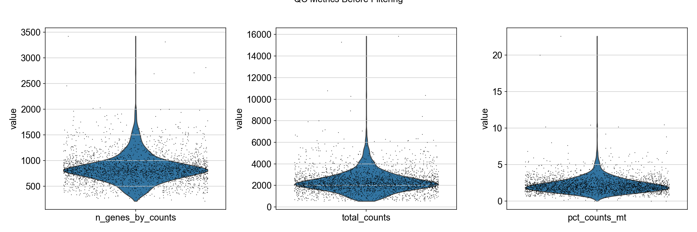
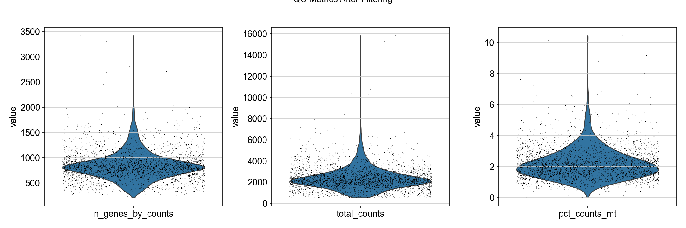
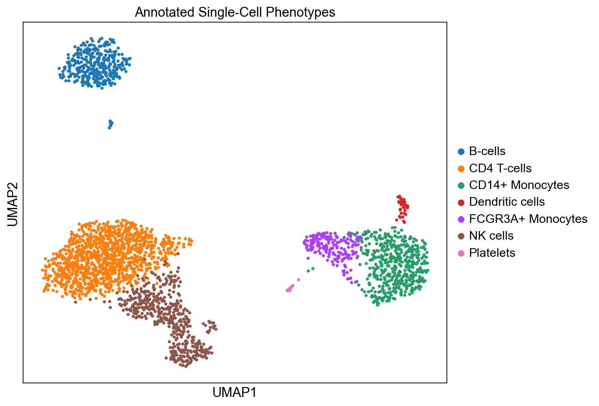
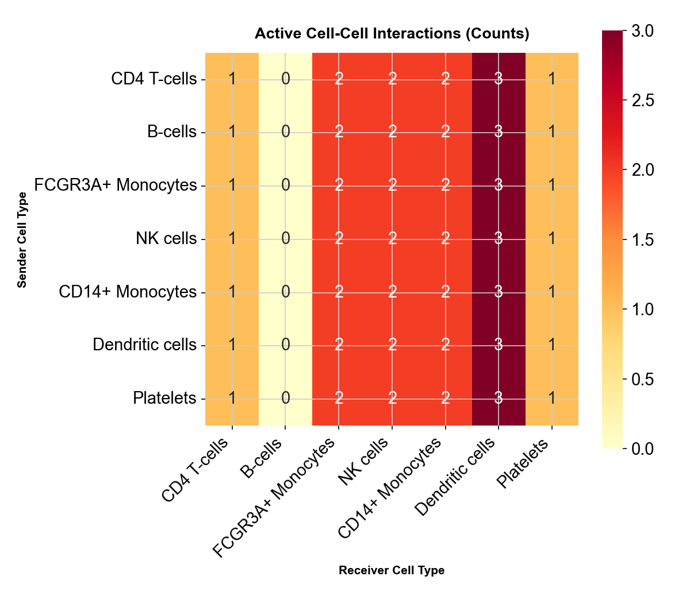
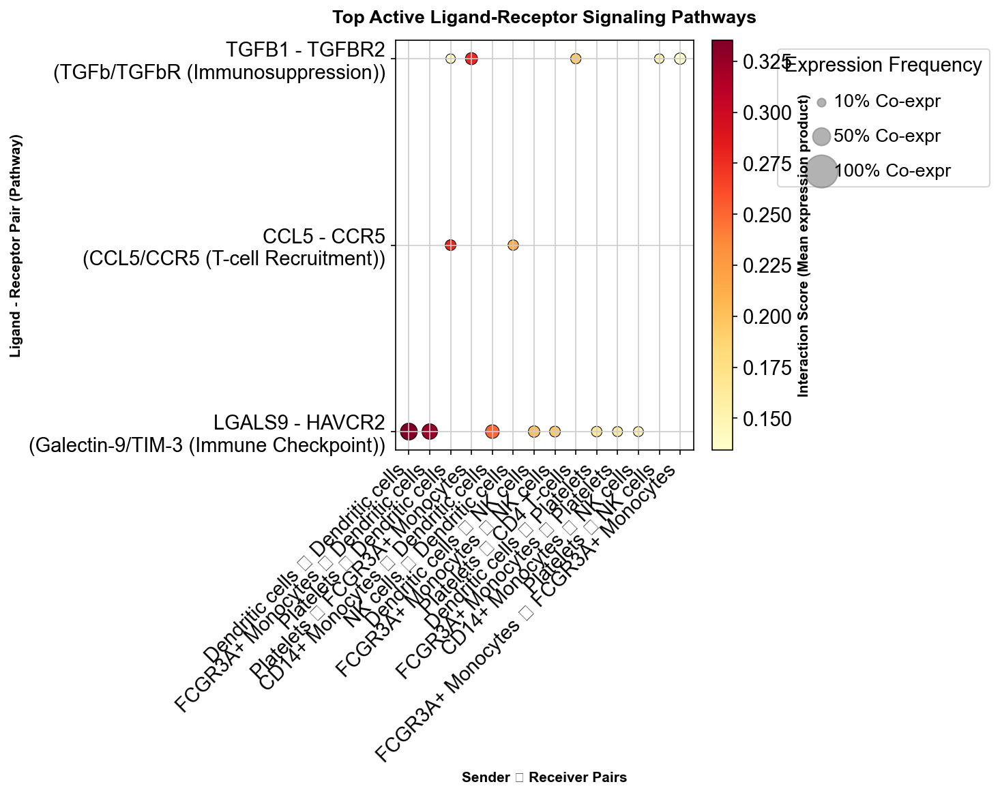
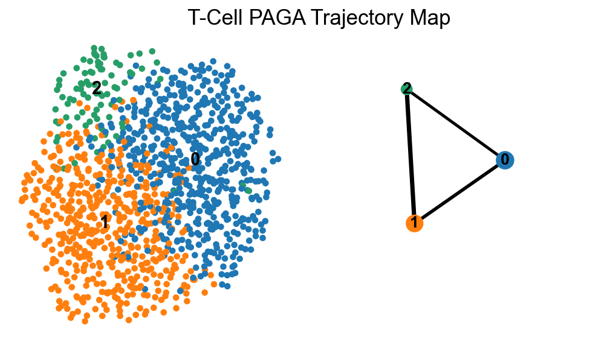
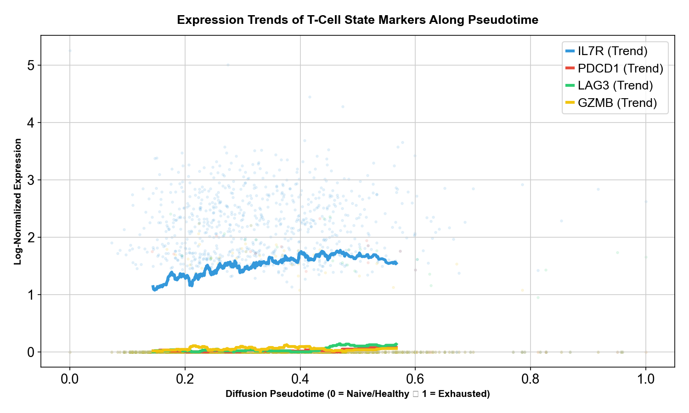

# 🧬 Deciphering Immune Evasion in TNBC via Single-Cell RNA-Seq

[](https://www.python.org/)
[](https://scanpy.readthedocs.io/)
[]()

## 📌 Executive Summary
Triple-Negative Breast Cancer (TNBC) is one of the most aggressive and difficult-to-treat cancer subtypes. This computational biology project utilizes **Single-Cell RNA Sequencing (scRNA-seq)** data to map the Tumor Microenvironment (TME) at a single-cell resolution. 

Rather than looking at bulk tissue, we isolate individual tumor cells, macrophages, and T-lymphocytes to answer a critical oncological question: **How do TNBC tumors manipulate and exhaust the immune system to evade destruction?**

---

## 🔬 Key Biological Discoveries

### 1. The Immunosuppressive Network (TGFB1 & LGALS9 Pathways)
By performing Receptor-Ligand communication analysis, we caught the tumor microenvironment "in the act" of suppressing the immune system:
* **The "Sleep" Command (`TGFB1` - `TGFBR2`):** Our network analysis revealed that Dendritic Cells and CD14+ Monocytes actively broadcast `TGFB1` ligands to T-cells and NK cells. In tumor biology, this pathway is a primary driver of immunosuppression.
* **T-Cell Exhaustion Checkpoint (`LGALS9` - `HAVCR2/TIM-3`):** We observed CD4 T-cells sending `LGALS9` signals to Macrophages. The Galectin-9/TIM-3 axis is a well-documented immune checkpoint mechanism that leads to T-cell exhaustion.
> *(See `results/cell_cell_interactions.csv` and our communication network plots for statistical scores).*

### 2. Trajectory of T-Cell Exhaustion (Pseudotime Analysis)
Not all T-cells in the tumor are the same. We isolated the T-cell population (1,153 cells) and used **PAGA (Partition-Based Graph Abstraction)** and Diffusion Pseudotime to trace their evolutionary timeline:
* **Root State:** We anchored the "Time Zero" of our trajectory to cells highly expressing **`IL7R`**, representing healthy, naive T-cells entering the tumor.
* **Exhaustion State:** We successfully mapped the chronological shift of these healthy cells into fully exhausted, ineffective states (Pseudotime score 1.0) due to the immunosuppressive signals mapped above.

---

## 📊 Visualizing the Tumor Microenvironment

Here are the key analytical results generated by our computational pipeline:

### A. Quality Control Distributions (Pre vs. Post Filtering)
Before filtering, raw reads contain dead cells (high mitochondrial genes) and empty droplets. The QC pipeline cleans and keeps only viable transcriptomes:
| Pre-filtering Quality Control | Post-filtering Quality Control |
|---|---|
|  |  |

### B. Single-Cell Landscape & Cell Type Annotation
By clustering cell populations and mapping established biological marker expressions, we resolve the TNBC immune landscape:


### C. Signaling Networks & Ligand-Receptor Crosstalk
This heatmap and dotplot show the counts of active interactions and detailed signaling strengths of immune checkpoints across cell types:
| Interaction Heatmap | Signaling Bubble Plot |
|---|---|
|  |  |

### D. T-Cell Exhaustion Trajectory Map & Marker Trends
Our trajectory mapping reveals how T-cells gradually exhaust over pseudotime:
| PAGA Trajectory Map | Exhaustion Gene Trends |
|---|---|
|  |  |

---

## ⚙️ Pipeline Modules Architecture

This repository is built with a modular, end-to-end Python architecture using `Scanpy`.

* **`Modul 1` Quality Control (QC) & Preprocessing:** Filters out low-quality transcriptomes, empty droplets, doublets, and apoptotic/dying cells (based on high mitochondrial `pct_counts_mt > 15.0%` thresholds).
* **`Modul 2` Clustering & Annotation:** Performs high-dimensional reduction (PCA, UMAP) and identifies cell communities (Louvain/Leiden). Automates cell-type annotation using established biological marker genes.
* **`Modul 3` Cell-Cell Communication:** Maps the complex receptor-ligand cross-talk between cancer and immune cells to identify immune evasion pathways.
* **`Modul 4` Trajectory & Pseudotime:** Constructs a dynamic evolutionary map showing the gradual exhaustion of T-cells within the hostile tumor microenvironment.

---

## 📁 Repository Structure

```text
tnbc_immune_evasion_scRNA/
│
├── data/                                 # Raw and preprocessed .h5ad datasets (git-ignored)
├── plots/                                # UMAPs, PAGA trajectories, and QC violin plots
│   ├── qc_violin_pre.png                 # QC metrics before filtering
│   ├── qc_violin_post.png                # QC metrics after filtering
│   ├── umap_clusters.png                 # Louvain/Leiden cluster distribution
│   ├── umap_cell_types.png               # Annotated single-cell landscape
│   ├── communication_heatmap.png         # Interaction count matrix
│   ├── communication_network.png         # Circular communication network
│   ├── communication_dotplot.png         # Signaling pathways dotplot
│   ├── umap_pseudotime.png               # T-cell UMAP colored by DPT score
│   ├── paga_trajectory.png               # T-cell exhaustion evolution map
│   ├── exhaustion_trends.png             # Exhaustion marker trends over DPT
│   └── marker_genes_dotplot.png          # Expression markers for cell identification
│
├── 01_scRNA_preprocessing_QC.py          # Modul 1: QC & mitochondrial filtering
├── 02_clustering_and_annotation.py       # Modul 2: UMAP & cell typing
├── 03_cell_cell_communication.py         # Modul 3: Receptor-Ligand networks
├── 04_trajectory_pseudotime.py           # Modul 4: PAGA & Diffusion Pseudotime
│
├── requirements.txt                      # scanpy, anndata, pandas, matplotlib, seaborn, etc.
└── README.md                             # Project documentation
```

---

## 🚀 Getting Started

### 1. Clone the Repository
```bash
git clone https://github.com/irembernaguven/single-cell-RNA-analysis.git
cd single-cell-RNA-analysis
```

### 2. Install Dependencies
It is recommended to use a virtual environment (e.g., conda or venv).
```bash
pip install -r requirements.txt
```

### 3. Run the Pipeline (Demo Mode)
You can test the entire pipeline sequentially using the built-in demo flag. This automatically downloads a public 3k PBMC dataset from Scanpy to demonstrate the calculations:
```bash
# Step 1: Preprocessing & Quality Control (Generates data/tnbc_tme_data.h5ad and data/tnbc_tme_data_qc.h5ad)
python 01_scRNA_preprocessing_QC.py --demo

# Step 2: Clustering & Cell Type Annotation (Generates data/tnbc_tme_data_annotated.h5ad)
python 02_clustering_and_annotation.py

# Step 3: Cell-Cell Communication (Generates results/cell_cell_interactions.csv)
python 03_cell_cell_communication.py

# Step 4: Trajectory & Pseudotime Analysis (Generates data/tnbc_tme_data_trajectory.h5ad)
python 04_trajectory_pseudotime.py
```
